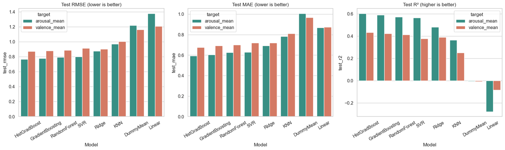
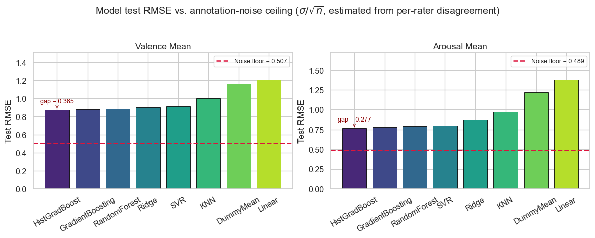
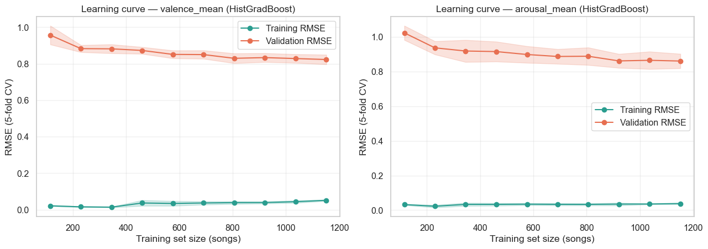
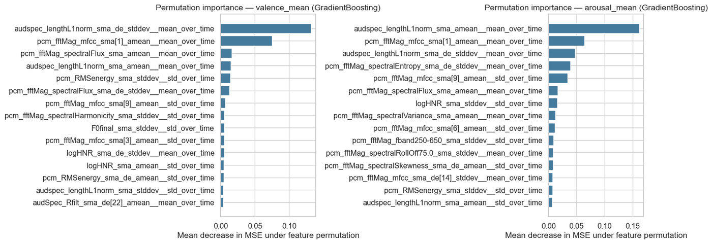
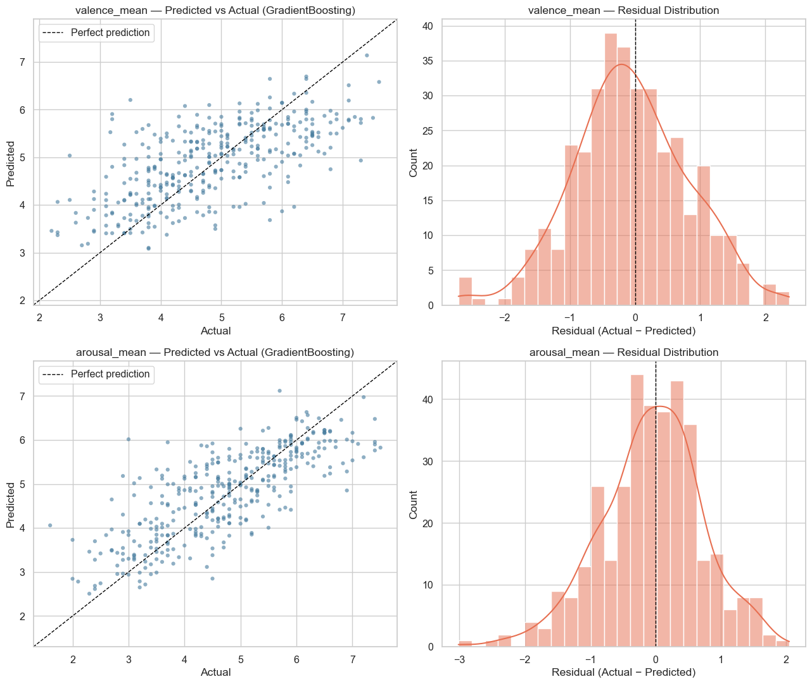

# Music Emotion Regression

[](https://github.com/asher0913/music-emotion-regression/actions/workflows/ci.yml)


A reproducible machine-learning study of song-level valence and arousal on the
DEAM dataset. The notebook turns 520 aggregated openSMILE acoustic descriptors
into a leakage-safe regression benchmark with classical, ensemble, and
histogram-based boosting models.

## Results

1,802 songs from DEAM, each described by 520 openSMILE descriptors: the mean and the standard
deviation over time of 260 base features. The targets are the mean valence and arousal ratings
on a 1–9 scale. A fixed 20% test split (361 songs) is scored once. Model selection uses
five-fold cross-validation on the rest, with variance filtering, imputation and scaling fitted
inside the folds.

| Target | Best model | MAE | RMSE | R² | 95% bootstrap RMSE interval |
| --- | --- | ---: | ---: | ---: | ---: |
| Arousal | HistGradientBoosting | 0.593 | 0.765 | **0.604** | 0.706–0.823 |
| Valence | HistGradientBoosting | 0.676 | 0.872 | **0.433** | 0.800–0.937 |



- **Arousal is much easier than valence** (R² 0.60 vs. 0.43 for every strong model). Energy and
  loudness are in the signal; whether a song sounds happy or sad depends more on harmony,
  lyrics and context, which frame-level descriptors barely capture.
- **The three tree ensembles are statistically tied.** HistGradientBoosting, GradientBoosting
  and Random Forest are within 0.03 RMSE of each other. Paired Wilcoxon tests on the five CV
  folds give p = 0.44–0.81. With five folds, the smallest possible p-value is 0.0625, so no
  pairwise difference can reach 0.05; the ranking is suggestive, not significant.
- **Annotator noise leaves a hard floor.** Each song has about 10 ratings. The standard error of
  their mean (σ/√n) puts an RMSE floor of 0.51 on valence and 0.49 on arousal: a perfect model
  would still miss the mean rating by that much. The best models are 0.37 and 0.28 above it.



- **More songs would help only a little.** Training RMSE is near 0.04 while validation RMSE
  sits at 0.82–0.86 and is still falling slowly at 1,150 training songs. The models are
  variance-limited, and the learning curve flattens well above the noise floor, so better
  features would likely matter more than more data.



- **Loudness dominates both targets.** Permutation importance ranks the auditory-spectrum L1
  norm, a loudness proxy, first: its mean for arousal, and its frame-to-frame variation for
  valence. The first MFCC (spectral tilt, roughly brightness) comes second for both.



- **Errors do not grow with disagreement.** The absolute error is slightly *negatively*
  correlated with annotator disagreement (Spearman ρ = −0.17 for valence, −0.20 for arousal,
  p < 0.002). Songs that raters disagree on tend to have mean ratings near the middle of the
  scale, where regression models are most accurate, so disagreement alone does not flag a hard
  song.



The notebook also covers:

- target distributions, the valence–arousal space, feature correlations and a PCA projection;
- a Ridge regularisation sweep showing the bias–variance trade-off;
- Random Forest and Gradient Boosting impurity importance, compared with permutation importance.

## Reproduce the notebook

```bash
python3 -m venv .venv
source .venv/bin/activate
pip install -r requirements.txt
jupyter lab notebooks/music_emotion_regression.ipynb
```

Run the first notebook cell to download the 18.7 MB feature table from the
companion [dataset release](https://github.com/asher0913/deam-song-level-features/releases/tag/1).
The repository versions only a privacy-preserving per-song summary of rater
counts and annotation variability under `data/`; individual rater IDs are not
retained.

Notebook outputs are retained so the full analysis and reported metrics can be
reviewed on GitHub without rerunning the multi-model search.

## Repository layout

```text
notebooks/music_emotion_regression.ipynb  # executable analysis and outputs
data/deam_rater_summary.csv              # per-song agreement statistics
docs/                                     # figures exported from the notebook for this README
outputs/                                  # generated when the notebook runs
```

## Data attribution

The analysis uses the Database for Emotional Analysis in Music (DEAM): Aljanaki,
Yang, and Soleymani, “Developing a benchmark for emotional analysis of music,”
*PLOS ONE* 12(3), 2017. The repository contains derived analysis code and one
compact annotation table; audio is not redistributed.
